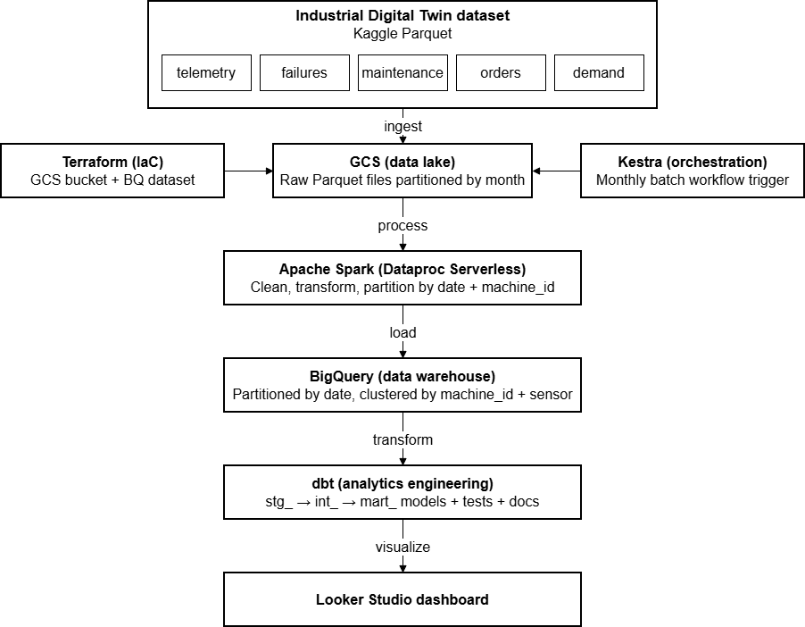
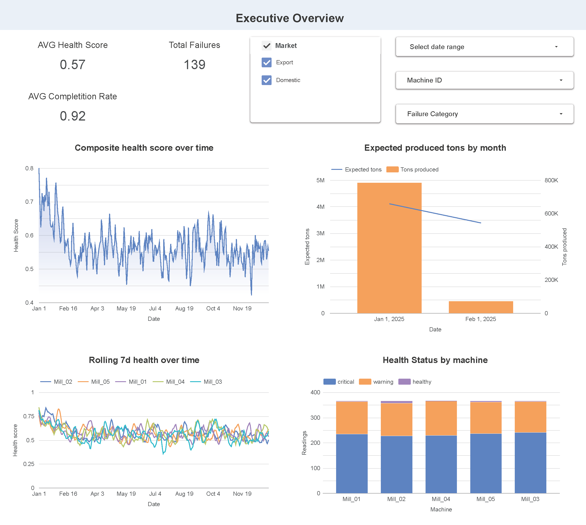

# Industrial Twin Pipeline

DE Zoomcamp final project: an end-to-end batch pipeline on GCP that processes 5 industrial datasets and serves analytics-ready marts for dashboards.

## What This Project Does

This project answers operational questions for a steel plant, such as:
- Which machines are degrading over time?
- Which failure categories and root causes are most frequent?
- Do demand pressure and rush factor correlate with delays and failures?

Pipeline flow:
1. Upload 5 parquet files to GCS.
2. Run PySpark as Dataproc Serverless batches to clean and type raw data into BigQuery raw tables.
3. Run dbt models (staging -> intermediate -> marts) in BigQuery.
4. Visualize with Looker Studio using the three mart tables.

## Tech Stack

- Infrastructure: Terraform
- Orchestration: Kestra
- Data lake: Google Cloud Storage
- Processing: PySpark on Dataproc
- Warehouse and transformations: BigQuery + dbt
- Dashboard: Looker Studio

## Architecture




## Datasets

The pipeline processes these files for year 2025:
- telemetry_2025.parquet
- failures_2025.parquet
- maintenance_2025.parquet
- orders_2025.parquet
- demand_2025.parquet

## Prerequisites

Required tools:
- GCP project with billing enabled
- gcloud CLI authenticated
- Terraform >= 1.0
- Python >= 3.13 and uv
- Docker (for local Kestra)
- Kaggle account + Kaggle API token

Authentication and local setup:
1. Create a service account key for this project and store it locally.
2. Export credentials and project variables before running scripts.

Example (bash):

```bash
export PROJECT_ID="industrial-digital-twin"
export GOOGLE_APPLICATION_CREDENTIALS="$(pwd)/terraform/keys/my-creds.json"
```

## GCP Setup (Project, Service Account, IAM)

If your project and service account already exist, you can skip this section.

### 1) Create/select a GCP project and enable billing

Create a project (optional if you already have one):

```bash
export PROJECT_ID="industrial-twin-pipeline"
export PROJECT_NAME="Industrial Twin"

gcloud projects create "$PROJECT_ID" --name="$PROJECT_NAME"
```

Enable billing in the GCP Console for this project before continuing.

Set active project:

```bash
gcloud config set project "$PROJECT_ID"
```

### 2) Enable required Google APIs

```bash
gcloud services enable \
  compute.googleapis.com \
  storage.googleapis.com \
  bigquery.googleapis.com \
  dataproc.googleapis.com \
  iam.googleapis.com \
  cloudresourcemanager.googleapis.com
```

### 3) Create service account

```bash
export SA_NAME="dev-idt"
export SA_EMAIL="${SA_NAME}@${PROJECT_ID}.iam.gserviceaccount.com"

gcloud iam service-accounts create "$SA_NAME" \
  --display-name="DEV Industrial Twin"
```

### 4) Grant required IAM roles

```bash
for role in \
  roles/storage.admin \
  roles/bigquery.admin \
  roles/dataproc.editor \
  roles/iam.serviceAccountUser
do
  gcloud projects add-iam-policy-binding "$PROJECT_ID" \
    --member="serviceAccount:${SA_EMAIL}" \
    --role="$role"
done
```

### 5) Create and store service-account key locally

```bash
mkdir -p terraform/keys

gcloud iam service-accounts keys create terraform/keys/my-creds.json \
  --iam-account="$SA_EMAIL"
```

### 6) Export environment variables for local runs

```bash
export GOOGLE_APPLICATION_CREDENTIALS="$(pwd)/terraform/keys/my-creds.json"
export DBT_PROJECT_ID="$PROJECT_ID"
```

Windows PowerShell equivalent:

```powershell
$env:PROJECT_ID = "industrial-twin-pipeline"
$env:GOOGLE_APPLICATION_CREDENTIALS = "$PWD/terraform/keys/my-creds.json"
$env:DBT_PROJECT_ID = $env:PROJECT_ID
```

### 7) Quick auth checks

```bash
gcloud auth list
gcloud config get-value project
```

## Quick Start (Reviewer Path)

If you want to validate quickly:
1. Provision infra with Terraform.
2. Place the 5 parquet files in data/.
3. Run ingest.py to upload data and Spark script to GCS.
4. Run Dataproc Spark job.
5. Run dbt run/test on prod target.
6. Open Looker Studio and connect to marts.

Use the full manual runbook below for exact commands and checks. Or use the automated mode with kestra.

## Run Option A: Automated with Kestra (Local Docker)

### 1) Start Kestra locally

```bash
cd kestra
docker compose up -d
cd ..
```

Open Kestra UI at http://localhost:8080

### 2) Configure secrets and KV values

Run setup flow once:
- Import and execute kestra/00_setup_kv.yaml.

Important:
- Replace the hardcoded Kaggle token in 00_setup_kv.yaml with your own token before use.
- Add GCP_SERVICE_ACCOUNT securely in Kestra namespace storage as a Key Value (full service account JSON content).

### 3) Run main flow

Import and execute:
- kestra/01_industrial_twin_pipeline.yaml

Execution input:
- year = 2025

Flow stages:
1. Download from Kaggle and upload to GCS.
2. Clean existing tables
3. Submit Dataproc Spark batch.
4. Run dbt deps + dbt run + dbt test.
5. Purge temp files.


## Run Option B: Manual Step-by-Step

### 1) Provision infrastructure

```bash
cd terraform
terraform init
terraform plan
terraform apply -auto-approve
cd ..
```

Optional verification:

```bash
cd terraform
terraform output gcs_bucket_name
terraform output bq_raw_dataset
terraform output bq_dbt_dataset
cd ..
```

### 2) Prepare local data files

Place these files in data/:
- telemetry_2025.parquet
- failures_2025.parquet
- maintenance_2025.parquet
- orders_2025.parquet
- demand_2025.parquet

Important:
- ingest.py verifies files and uploads them.
- ingest.py does not download from Kaggle.

### 3) Upload raw files to GCS

```bash
uv sync
uv run python ingest.py --bucket it_datalake_${PROJECT_ID}
```

This uploads:
- gs://it_datalake_${PROJECT_ID}/raw/year=2025/*.parquet
- gs://it_datalake_${PROJECT_ID}/code/transform.py

### 4) Submit Spark transformation (Dataproc Serverless)

```bash
gcloud dataproc batches submit pyspark \
  --region=europe-west1 \
  --project=${PROJECT_ID} \
  gs://it_datalake_${PROJECT_ID}/code/transform.py \
  -- \
  --input_prefix=gs://it_datalake_${PROJECT_ID}/raw/year=2025 \
  --project=${PROJECT_ID} \
  --dataset=industrial_twin_raw \
  --temp_bucket=it_datalake_${PROJECT_ID} \
  --year=2025
```

Expected BigQuery raw tables:
- telemetry
- failures
- maintenance
- orders
- demand

### 5) Run dbt models

Create local dbt profile:

```bash
mkdir -p ~/.dbt
cp dbt/profiles.yml ~/.dbt/profiles.yml
```

Then edit ~/.dbt/profiles.yml and set keyfile to your local key path.

Run dbt:

```bash
cd dbt
dbt deps
dbt run --target prod
dbt test --target prod
cd ..
```

Expected marts in industrial_twin_prod:
- mart_machine_health
- mart_failure_analysis
- mart_production_performance

### 6) Validate with sample queries

```sql
SELECT COUNT(*) AS cnt FROM `industrial-digital-twin.industrial_twin_prod.mart_machine_health`;
SELECT COUNT(*) AS cnt FROM `industrial-digital-twin.industrial_twin_prod.mart_failure_analysis`;
SELECT COUNT(*) AS cnt FROM `industrial-digital-twin.industrial_twin_prod.mart_production_performance`;
```


## Looker Studio

Connect BigQuery dataset industrial_twin_prod and use:
- mart_machine_health
- mart_failure_analysis
- mart_production_performance

Current report link: [Industrial Twin Dashboard](https://lookerstudio.google.com/reporting/21a03fd6-503d-449a-81d7-c3d3487f8012)




## dbt Lineage

```text
stg_telemetry ---------------------+
stg_failures ----------------------+---> int_telemetry_enriched  ---> mart_machine_health
stg_maintenance -------------------+                              ---> mart_failure_analysis
stg_orders ------------------------+                              ---> mart_production_performance
stg_demand ------------------------+
```

## Troubleshooting

- Error: profiles.yml not found
  - Fix: copy dbt/profiles.yml to ~/.dbt/profiles.yml and update keyfile path.

- Error: Missing files in data/
  - Fix: place all 5 parquet files in data/ before running ingest.py.

- Error: Source tables missing during dbt run
  - Fix: rerun Dataproc Spark step and confirm raw tables exist in industrial_twin_raw.

- Error: Kestra cannot resolve GCP_SERVICE_ACCOUNT
  - Fix: verify secret exists in the industrial_twin namespace and is valid JSON.

- Error: Dataproc job succeeded but no rows in BigQuery
  - Fix: inspect Dataproc logs and confirm input_prefix paths and year match uploaded files.

## Project Structure

```text
industrial-twin-pipeline/
├── terraform/
├── kestra/
├── spark/
├── dbt/
├── data/
├── ingest.py
├── Makefile
├── pyproject.toml
└── README.md
```
